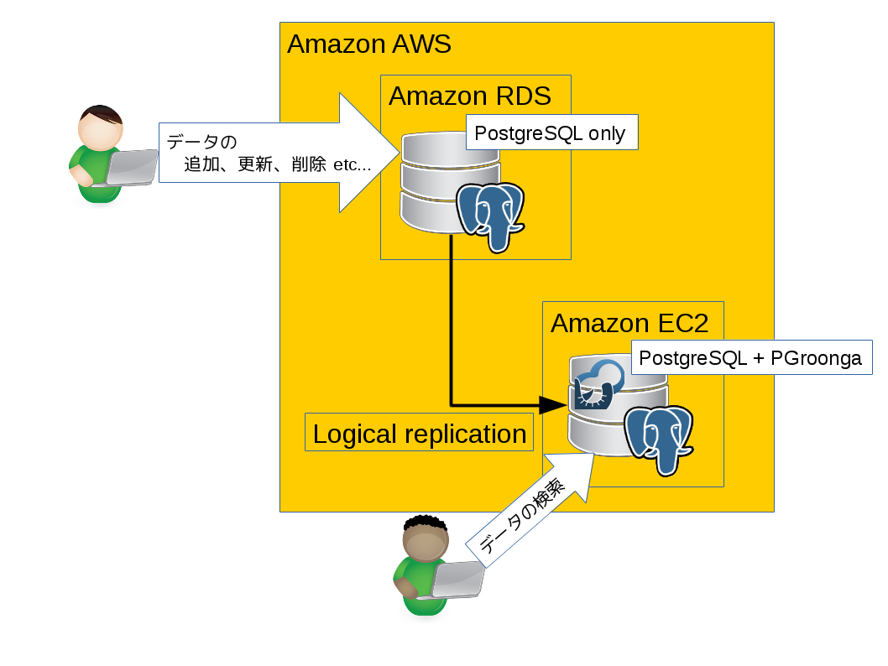
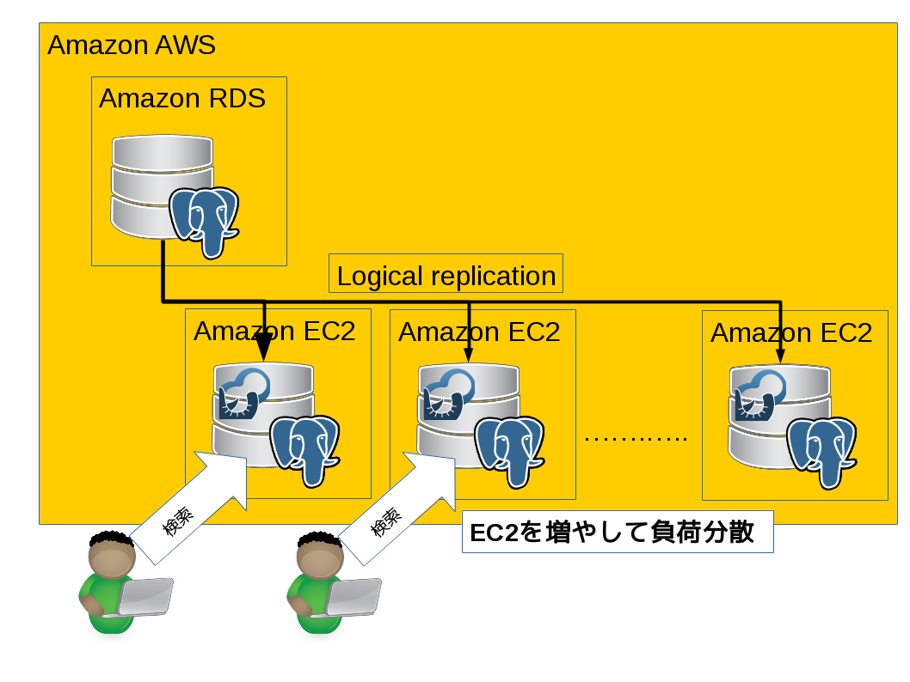

= Amazon RDS, Amazon EC2, PGroonga\nロジカルレプリケーション\nを使った低コスト高速全文検索

: author
   堀本泰弘
: institution
   クリアコード
: content-source
   PostgreSQL Conference Japan 2019
: date
   2019-11-15
: start-time
   2019-11-15T14:10:00+09:00
: end-time
   2019-11-15T15:00:00+09:00
: theme
.

# 目次

* 自己紹介
* Amazon RDSとは？
* 高速な全文検索を実現する拡張PGroongaとは？
* Amazon RDS と PGroonga
* RDS と EC2 と PGroonga とロジカルレプリケーションを組み合わせる
  * この構成のメリット
  * この構成のデメリット
* EC2の立ち上げ時間がかかる問題をどう解消するのか？

# 自己紹介

* 名前：堀本 泰弘
* 所属：ClearCode.Inc
* 普段の業務
  * 超高速な全文検索エンジンGroongaの開発/サポート
  * 超高速な全文検索機能を提供するPostgreSQL拡張 PGroongaの開発/サポート
  * 超高速な全文検索機能を提供するMySQL用のストレージエンジンMroongaの開発/サポート
  * GroongaのRubyバインディングRroongaの開発/サポート
  * その他、Groonga関連ツールの開発/サポート
* 全文検索でお困りの方は、是非ご相談ください。
  * info@clear-code.com または https://www.clear-code.com/contact/ でお問い合わせください。

# Amazon RDSとは？

* Amazon RDSは、クラウド上にリレーショナルデータベースを構築するサービスです。
* 簡単な操作、あるいは自動で、データベースのセットアップやパッチ適用、バックアップ等が実行でき、管理負担を軽減できます。
  * 設定パラメータは予め最適化されているため、Amazon RDS作成後、数分でアプリケーションの接続ができます。
  * パッチは自動的に適用され、常に最新のバージョンで動作します。(パッチ適用のタイミングを指定することもできます。)
  * メトリクスを分析して、より運用環境に適した設定にすることが出来ます。(メトリクスの分析は自動で実施されます。)
  * ワンタッチでCPUやメモリーをスケールアップまたは、スケールダウンできます。
  * ストレージのスケールアップ、スケールダウンも容易で、こちらはダウンタイムなしで実施できます。
  * バックアップは自動で実施されます。
  * ハードウェア障害が起きた場合は、自動的にハードウェアが交換されます。
  * レプリケーションも自動で実施されます。(ファイルオーバーは通常1〜2分。フェイルオーバーも自動で行われます。)
  * などなど...。

# PGroongaとは？

* PostgreSQL経由で使える超高速な全文検索エンジン
  * 全文検索エンジンサーバーを使うとそれぞれ、独自の使い方をしているので実装コストやメンテナンスコストが高いです。
  * ですが、PostgreSQL単体では、機能不足ですし、速度が出ません。

# PGroongaとは？

* PostgreSQL経由で全文検索エンジンを使えれば、実装コスト、メンテナンスコストを小さくしつつ、全文検索に十分な機能と速度を実現できます。
  * PostgreSQL経由で全文検索エンジンを使う拡張機能がPGroongaです。

# Amazon RDS と PGroonga

* ここまで見てきたように、Amazon RDSはとても便利です。
* これを使えば運用がだいぶ楽になります。

# Amazon RDS と PGroonga

* ただ、良いことばかりではありません。
* Amazon RDSは自由に拡張機能をインストールできないのです。

# Amazon RDS と PGroonga

* 自由に拡張機能がインストールできないので、PGroongaもAmazon RDSでは使えません。
* PGroongaを既にご存じの方は、Amaozn RDSにPGroongaがインストールできれば、運用も楽で高速、高機能な全文検索ができるのに。。。と思う方も多いと思います。
* この発表でも、Amazon RDSにPGroongaはインストールしていません。
  * していませんが、Amazon RDSのメリットを活かす構成にしています。

# RDS + EC2 + PGroonga + ロジカルレプリケーション

* この構成は以下の４つの要素を組み合わせて実現しています。

* Amazon RDS
* Amazon EC2
* PGroonga
* ロジカルレプリケーション

# RDS + EC2 + PGroonga + ロジカルレプリケーション

これらの要素を組み合わせて、このような構成をつくりました。

# RDS + EC2 + PGroonga + ロジカルレプリケーション

* Amazon RDSは更新専用にします
* Amazon EC2は検索専用にします
* ロジカルレプリケーションは、DDLがレプリケーションされないので、サブスクライバであるEC2にのみPGroonga拡張をインストールして、全文検索用のインデックスを設定できます

# RDS + EC2 + PGroonga + ロジカルレプリケーション

* マスターデータは、RDSからロジカルレプリケーションで取得できるため、RDS上データさえあれば、EC2での検索が可能です
* マスターデータがないと検索できなくなるので、マスターデータは大切に守る必要があります。
* マスターデータはRDS上にあるので、データの安全な管理は楽にできます。

# RDS + EC2 + PGroonga + ロジカルレプリケーション

* ここで紹介したのは、最もシンプルな構成です。
* マスターデータはRDS上にあり、EC2へはロジカルレプリケーションでデータを同期します。
* そのため、新規にEC2インスタンスを作成して、サブスクライバとしてRDSに接続すれば、容易に検索用のサーバーを作ることができます。

# 検索の負荷分散

* 検索リクエストが増加した際は、この特徴を活かして、EC2インスタンスを増やすことで負荷を軽減できます。

# EC2の復旧

* データはRDSから取得できるため、もしEC2の具合が悪くなったら破棄して新規にEC2をつくることでシステムを健全に保つことができます。
* 具合が悪い原因を調査して特定して復旧するという作業は必要ありません。

# この方式のデメリット

* RDSに保持しているデータが多くなってくると、EC2の作成時間が長くなってきます。
* レプリケーションの時間が増えるためです。
* つまり、復旧までの時間が長くなってきます。

# デメリットをどうやって解消するのか？

* EC2の復旧時間(レプリケーションが完了するまでの時間)は、データ量に比例するのである程度予測できます。
* この復旧にかかる時間の間、残りの検索専用のEC2インスタンスでリクエストをさばく必要があります。

# デメリットをどうやって解消するのか？

* ここで重要なのは、以下の2点です。
  * 新しいインスタンスを準備している間他のEC2インスタンスで検索処理を賄う必要があるので、新しいEC2インスタンスがセットアップ完了するまで、他のEC2インスタンスが故障しないこと
  * セットアップ完了までに他のEC2インスタンスでサービスを継続できるようにすること

# デメリットをどうやって解消するのか？

* 例えば、LBを使ってEC2へのアクセスを分散していたとします。
* この時、それぞれのEC2インスタンスの負荷が100%に近い場合は、EC2のどれか１つを作り直す状況になった場合、他のEC2の負荷が100％を超えてしまうため、サービスの継続が難しくなります。

# デメリットをどうやって解消するのか？

同時に何台故障する確率なのか、サービスを継続できるEC2の台数は何台なのか、EC2を新しく用意すうのにかかる時間はどのくらいなのかをそれぞれ把握し、何台並列稼働させるかを計算することが大事です。

# デメリットをどうやって解消するのか？

例えば、故障率○のケースでは、以下の計算○○台並列で稼働させれば良いことになります。

# デメリットをどうやって解消するのか？

計算の方法はこんな感じです。

# デメリットをどうやって解消するのか？

RDSに保持するデータが多くなってきて、新しいEC2インスタンスを作るのに時間がかかる場合は、故障率などを計算し、いくつかのEC2インスタンスを並列稼働させることで、ダウンタイムが長くなってもサービスを継続できる構成にします。

# デメリットをどうやって解消するのか？

EC2を複数台稼働させる場合でも、基本的に設定は同じでデータはRDSからロジカルレプリケーションで取得できるため、並列稼働もそれほど、手間をかけずに構築できます。

# まとめ

* RDSのメリットを活かしつつ、PGroongaを使った高速な全文検索を行う方法を紹介しました。
* クリアコードでは、PGroongaの開発や運用の支援だけでなく、どのような構成で全文検索を行うかなどの導入の支援も行っています。

* 全文検索でお困りの方は、是非ご相談ください。
  * info@clear-code.com または https://www.clear-code.com/contact/ でお問い合わせください。
